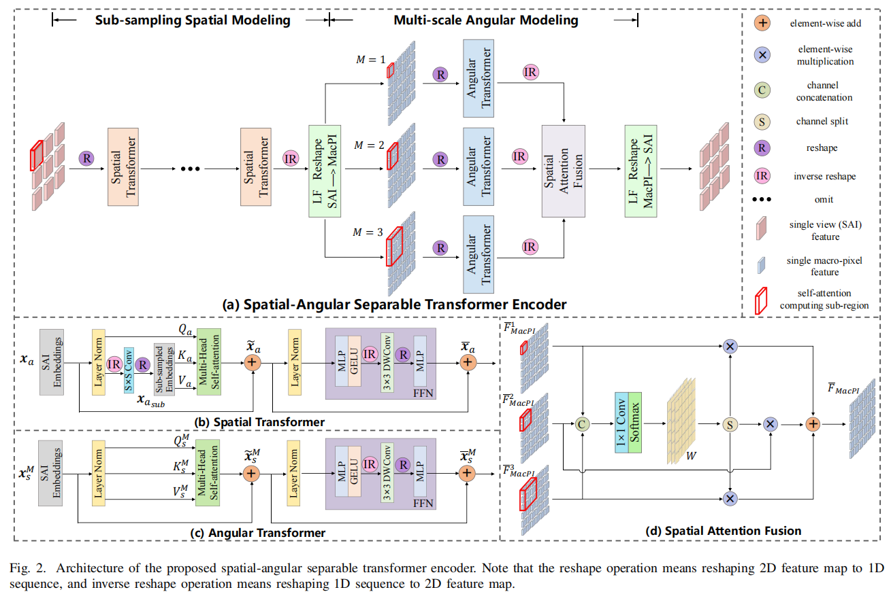
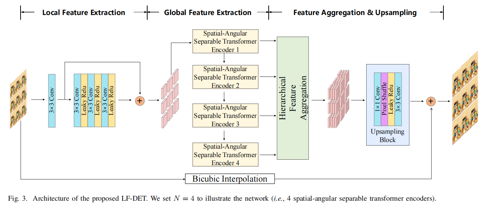
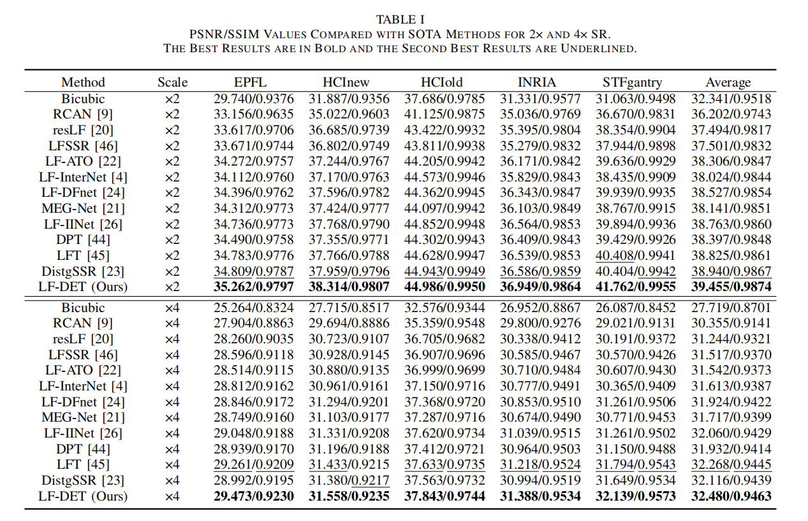

# LF-DET

This is the official pytorch implementation repository of [Exploiting Spatial and Angular Correlations With Deep Efficient Transformers for Light Field Image Super-Resolution.](http)





## Datasets

Following [BasicLFSR](https://github.com/ZhengyuLiang24/BasicLFSR), we use five datasets, including EPFL, HCInew, HCIold, INRIA and STFgantry for training and testing. Please download the datasets in the official repository of [BasicLFSR](https://github.com/ZhengyuLiang24/BasicLFSR).

Besides, we use three datasets, including UrbanLF, DLFD, SLFD to validate the effectiveness of LF-DET for addressing disparity variation in LF-SSR. Please first download the datasets via [Baidu Drive](https://pan.baidu.com/s/11GDRworVB6QJpVleBf3WKw) (key:lv31) . 

## Results



## Code

### Dependencies

- pytorch 1.8.0 + torchvision 0.9.0 + cuda 10.2 + python 3.8.10
- matlab 

### Training and Test Data

Please refer to [BasicLFSR](https://github.com/ZhengyuLiang24/BasicLFSR) for detailed introduction.

### Train

- Run

```python
python train.py
```

- The specific configuration information is in `config.py` which can be changed.

### Test

- Run

```
python test.py
```

- The specific configuration information is in `config.py` which can be changed.
- The folder `pretrain` contains **our pre-trained models with default configuration information for 2x SR and 4x SR**.

## Acknowledgement

Our work and implementations are inspired and based on the following projects:

- [BasicLFSR](https://github.com/ZhengyuLiang24/BasicLFSR)
- [LFT](https://github.com/ZhengyuLiang24/LFT)

We sincerely thank the authors for sharing their code and amazing research work!

## Citation

If you find this work helpful, please consider citing the following papers:

```

```

